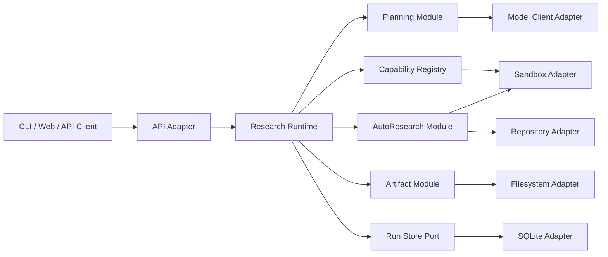

# ResearchFlow Agent Python 架构设计

## 1. 文档状态

| 字段 | 内容 |
|---|---|
| 版本 | v0.1 |
| 日期 | 2026-08-14 |
| 状态 | Accepted，作为首版代码框架基线 |
| 产品需求 | [PRD v0.2](PRD.md) |
| 业务基线 | Sea-mult-agent `3f2b327` |
| Python 参考 | AGI-saber |

## 2. 架构结论

首版采用 **异步 Python 模块化单体 + 端口/适配器**。模块在同一进程和代码仓库中部署，但只能通过类型化契约协作。当前不拆微服务，也不把 LangChain、LangGraph 或某个模型 SDK 作为核心抽象。

这不是对 Sea-mult-agent Go 目录的逐文件翻译，而是对其业务行为和可信边界的兼容重构：

- Sea-mult-agent 决定计划图、任务状态机、执行租约、预算、事件、审批和 AutoResearch 的语义。
- Saber 提供 Python 组合根、FastAPI、适配器、降级和测试组织方面的参考。
- ResearchFlow Agent 自己拥有领域模型、运行时协议和状态迁移，避免形成同时负责规划、工具、记忆、执行和 API 的巨型 Agent 类。

## 3. 系统边界



依赖方向始终指向领域和用例层。FastAPI、数据库、Docker、Git 与模型供应商都位于边缘，不能反向定义核心状态。

## 4. 模块职责

| 模块 | 单一职责 | 稳定对外接口 |
|---|---|---|
| `domain` | 计划、运行、任务、事件、产物和错误语义 | 不依赖框架的不可变模型 |
| `runtime` | 命令处理、状态迁移、调度、租约、预算和事件提交 | `ResearchRuntime`、`RunStore` |
| `planning` | 将研究意图构造成合法计划图 | `PlanningModule.build()` |
| `capabilities` | 注册和调用检索、代码、数据等原子能力 | `Capability.invoke()` |
| `autoresearch` | 冻结契约、候选生成、试验、Keep/Reject、回滚和复验 | `AutoResearchModule.run()` |
| `artifacts` | 产物存储、摘要校验、来源和版本 | `ArtifactStore` |
| `adapters` | SQLite、Docker、Git、文件系统、模型供应商等实现 | 实现消费方定义的端口 |
| `api` | HTTP/SSE 输入输出、鉴权和错误映射 | FastAPI 路由，不包含业务规则 |
| `bootstrap` | 读取配置并组装真实实现 | 唯一组合根 |

禁止创建无边界的 `utils`、`common` 或 `UnifiedAgent`。只有在至少两个真实调用点产生相同、稳定的领域概念时才提取共享模块。

## 5. 核心接口

### 5.1 Research Runtime

运行时面向业务调用同时保留同步命令和非阻塞提交语义，进程生命周期负责启动 Worker 与中断恢复；历史事件和实时订阅共享持久化事件事实来源。

```python
class ResearchRuntime(Protocol):
    async def recover_interrupted_runs(self) -> int: ...
    async def close(self) -> None: ...
    async def run_worker(self) -> None: ...
    async def submit(self, command: RunCommand) -> CommandResult: ...
    async def dispatch(self, command: RunCommand) -> CommandResult: ...
    async def get(self, run_id: str) -> RunSnapshot: ...
    def events(self, run_id: str, after_sequence: int = 0) -> AsyncIterator[RunEvent]: ...
    def watch_events(self, run_id: str, after_sequence: int = 0) -> AsyncIterator[RunEvent]: ...
```

调度器内部可演进，但不得绕过以下约束：

1. 任务只有依赖全部成功且输入产物有效后才能进入 `READY`。
2. 每次执行生成新的 `execution_id` 和 `lease_epoch`；迟到结果不得覆盖新执行。
3. 快照与事件通过 `RunStore.commit()` 原子提交，并使用版本号处理并发冲突。
4. 暂停、取消和预算耗尽必须通过显式状态迁移传播，不能只停止 HTTP 请求。
5. 重试必须遵守任务策略和总预算。
6. 进程启动恢复只能把中断执行转换为安全状态，不能复用旧执行身份或在 API/存储适配器中实现状态规则。
7. Worker 领取以原子 Task 开始提交为准；只有持有当前 `execution_id` 和 `lease_epoch` 的执行结果可改变状态。
8. SSE 只推送已经提交的事件，并通过单调序号支持重连续读。

### 5.2 Planning

`PlanningModule` 接收类型化上下文并返回已经过结构校验的 `PlanDefinition`。LLM 可以提出计划，但确定性校验器负责节点唯一性、依赖存在性、无环性、能力可用性和预算合法性。

### 5.3 Capability

Agent 在本架构中是“受约束的能力实现”，不是整个系统的所有者。每个能力只有一个异步入口，输入、输出和失败均可序列化。首版能力包括 Librarian、Coder、Research Coding 和 Data；后续 RAG、Memory 和 Skill 以新能力或适配器接入。

### 5.4 AutoResearch

AutoResearch 与普通任务执行分离，因为它拥有独立的可信计算协议。两种模式共享以下骨架：

```text
冻结研究契约 -> 重复基线 -> 生成候选 -> 隔离执行 -> 确定性评测
             -> Keep/Reject -> 账本记录 -> 预算/目标判断 -> 最终复验
```

- `CODE_PATCH`：候选是受限文件范围内的补丁，保护评测器和数据，Reject 后回滚工作区。
- `CONFIGURATION`：候选是有限策略、模块和参数空间中的配置，先在 Search 集搜索，再由 Holdout 集复验。
- 模型只能提出候选和解释；评测器、方向、聚合方法、数据摘要、仓库版本和停止条件必须冻结。
- 结果只能表述为“在给定空间和预算内找到的最佳已验证候选”，不得声称全局最优。

## 6. 数据与一致性

领域对象使用不可变 dataclass；API 和外部文件使用 Pydantic 做版本化校验。当前已经使用 SQLite + SQLAlchemy Async 持久化 Run 快照和事件，后续可在保持 `RunStore` 端口的前提下替换 PostgreSQL。

`RunStore` 采用乐观并发：

```text
load(version=N)
  -> 执行纯状态迁移
  -> commit(snapshot version=N+1, events, expected_version=N)
  -> 冲突时重新加载并判断命令是否仍可执行
```

事件序号在每个 Run 内单调递增。大文件不写入事件或数据库行，只保存 `ArtifactRef`，实际内容进入文件系统或对象存储。产物必须记录 SHA-256、schema version、生产任务和位置。

## 7. 并发与取消

- 使用 AnyIO TaskGroup/CancelScope 进行结构化并发；禁止裸线程修改共享 Agent 状态。
- 每个任务有独立超时、执行 ID 和单调租约 epoch；当前单进程 Worker 不声明远程心跳续租能力。
- Worker 可以并发处理不同 Run；同一 Run 内无依赖冲突 Task 由 `RunBudget.max_concurrency` 限流并行执行。
- 并发度、模型 token、墙钟时间和试验次数都由 `RunBudget` 控制。
- API 断开不取消 Run；显式取消命令或策略才会终止执行。
- 阻塞的 Git、Docker 和文件操作放入受控线程池，不污染事件循环。

## 8. 错误策略

| 错误 | 含义 | 默认处理 |
|---|---|---|
| `ContractViolation` | 输入、计划或状态迁移不合法 | 拒绝请求，不重试 |
| `ConflictError` | 快照版本或租约冲突 | 重新加载后有限重试 |
| `NotFoundError` | Run、任务或产物不存在 | 映射 404 |
| `PolicyViolation` | 触碰保护文件、预算或安全策略 | 立即停止对应操作 |
| `DependencyUnavailable` | 模型、数据库、Docker 等暂不可用 | 依策略退避重试 |
| `ExecutionFailure` | 候选或任务真实执行失败 | 记录证据并进入重试/Reject |

生产环境不允许 Docker 不可用时静默切到 Mock Sandbox；Mock 只能通过测试配置显式启用。

## 9. 工程布局

```text
ResearchFlow-Agent/
├── docs/
├── src/researchflow/
│   ├── api/
│   ├── domain/
│   ├── runtime/
│   ├── planning/
│   ├── capabilities/
│   ├── autoresearch/
│   ├── artifacts/
│   ├── adapters/
│   ├── bootstrap.py
│   └── settings.py
└── tests/
    ├── domain/
    ├── adapters/
    ├── integration/
    └── acceptance/
```

模块内测试关注状态和规则；适配器必须通过统一契约测试；SQLite、文件系统和 Fake Sandbox 组成集成测试；PRD 的 AC-01 至 AC-10 最终成为验收测试。

## 10. 实施顺序

1. **运行闭环**：提交目标、生成固定计划、后台并行执行 Fake Capability、持久化状态、重启恢复和 SSE；当前已完成。
2. **真实执行**：Docker Sandbox、Git 仓库、产物存储、租约与恢复。
3. **科研能力**：Librarian、Coder、Data 与证据化报告。
4. **配置型 AutoResearch**：有限搜索空间、TrialLedger、Search/Holdout。
5. **代码补丁型 AutoResearch**：保护文件、补丁验证、回滚和重复复验。
6. **扩展能力**：RAG、长期记忆、Skill 与更多模型供应商。

每一步都交付可运行的端到端垂直切片，不按“先写完所有基础层、最后才集成”的方式推进。

## 11. 参考映射

| 设计主题 | Sea-mult-agent 基线 | Saber 参考 |
|---|---|---|
| 计划图与运行状态 | `backend/internal/models/graph.go` | `final/internal/graph/` |
| 调度、租约与迟到结果隔离 | `backend/internal/scheduler/` | 不沿用其共享可变 GraphRuntime |
| AutoResearch 契约 | `backend/internal/models/autoresearch.go`、`experiment_research.go` | Sandbox 接口与测试替身 |
| 持久化端口 | `backend/internal/store/plan_store.go` | `final/internal/infra/` 的组合方式 |
| Python 启动 | 不适用 | `final/main.py` 的 build-deps / FastAPI 模式 |

兼容目标是行为与验收标准一致，而不是复刻 Go 的内部 API 或 Saber 的类层级。
