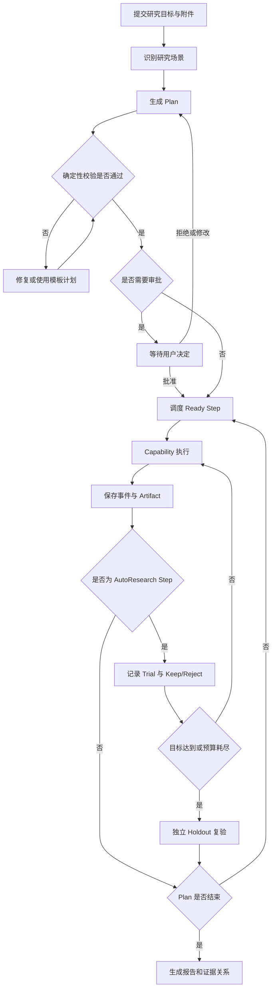
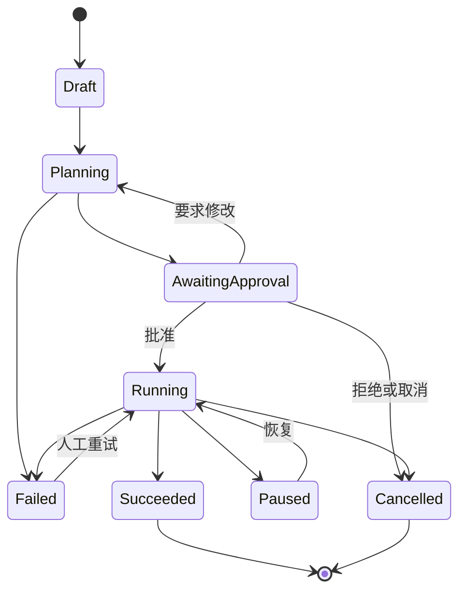
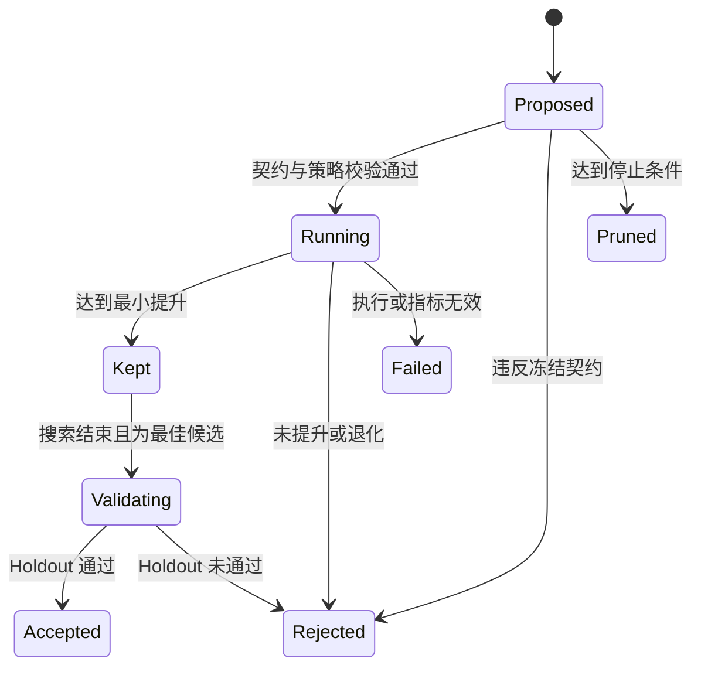

# ResearchFlow Agent 产品需求文档

## 0. 文档信息

| 字段 | 内容 |
|---|---|
| 产品名称 | ResearchFlow Agent |
| 文档版本 | v0.2 |
| 文档状态 | Draft，待评审 |
| 创建日期 | 2026-08-14 |
| 产品阶段 | 需求定义 |
| 目标实现语言 | Python |
| 业务基线 | Sea-mult-agent（2026-08-12 `3f2b327`） |
| 扩展参考 | AGI-saber |

### 0.1 版本记录

| 版本 | 日期 | 变更 |
|---|---|---|
| v0.1 | 2026-08-14 | 建立产品定位、MVP 范围、功能需求和验收标准 |
| v0.2 | 2026-08-14 | 切换至 Sea-mult-agent 新基线，纳入两类 Scientific AutoResearch、冻结研究契约、TrialLedger 与 Holdout 验收 |

### 0.2 文档目的

本文档用于在架构设计和编码开始前冻结第一阶段产品范围，统一业务术语、核心流程、优先级与验收口径。

本文档描述“做什么”和“做到什么程度”，不展开包结构、数据库表、类接口或具体框架实现。技术方案将在 PRD 评审通过后单独编写。

---

## 1. 产品摘要

ResearchFlow Agent 是一个使用 Python 实现的多智能体科研执行系统。系统接收研究目标、论文、代码仓库和数据文件，将目标转换为经过校验的任务计划，在受控环境中完成资料检索、代码准备、实验执行、指标分析和报告生成，并保留完整的状态、日志、证据与产物。

第一阶段以 Sea-mult-agent 当前业务为基线，覆盖论文复现、自有数据评测和预算受限的 Scientific AutoResearch。AutoResearch 包含两种模式：在论文仓库中搜索受限代码补丁，以及在用户数据上搜索方法、模块和超参数配置。系统冻结评测器、数据、仓库版本、候选空间和停止条件，由模型提出可证伪候选，由确定性执行内核依据真实指标完成 Keep/Reject、回滚、目标停止和最终复验。后续再吸收 AGI-saber 的 RAG、长期记忆、Skill 和工具扩展能力。

### 1.1 一句话定位

> 将科研目标转化为可执行、可观察、可暂停恢复且能在固定预算内持续验证候选的研究工作流。

### 1.2 核心价值

1. 从“生成回答”升级为“完成研究任务”。
2. 将资料、代码、实验、指标和报告收敛到同一次研究执行中。
3. 通过确定性校验、预算、审批和沙箱约束模型行为。
4. 通过 Artifact 与 Evidence 让研究结论可验证、可复查。
5. 通过持久化状态支持失败重试和服务重启后的断点恢复。
6. 通过冻结研究契约、重复测量和 Holdout 复验降低实验过拟合与结果漂移。
7. 通过 TrialLedger 完整保留 Baseline、失败候选、Keep/Reject 原因和停止依据。

---

## 2. 业务背景与问题

### 2.1 业务背景

论文理解、方法复现和技术评估通常包含多个连续环节：

当前工作经常分散在搜索工具、文献工具、IDE、终端、容器、笔记和对话式 AI 中。用户需要手动转移上下文、记录执行状态并核对结果，任务中断后也难以从可靠位置继续。

### 2.2 待解决问题

| 编号 | 问题 | 影响 |
|---|---|---|
| PB-01 | 对话式 AI 主要生成文字，不能稳定执行长链路任务 | 用户仍需手工完成主要工作 |
| PB-02 | 规划由模型自由生成，缺少依赖、输入输出和预算约束 | 容易出现不可执行计划或失控调用 |
| PB-03 | 第三方代码直接运行风险较高 | 可能污染宿主机或消耗失控资源 |
| PB-04 | 日志、指标、代码和报告分散 | 结论难以复核和复现 |
| PB-05 | 失败、取消或重启后缺少可靠恢复能力 | 长任务需要从头执行 |
| PB-06 | 模型结论与真实实验结果边界不清楚 | 用户难以判断结论可信度 |
| PB-07 | 新增 Agent 或工具需要修改主流程 | 扩展成本高，容易破坏调度内核 |
| PB-08 | 方法改进依赖人工反复修改、运行和比较 | 搜索过程耗时且失败候选、回滚依据容易丢失 |
| PB-09 | 在同一公开评测集上反复调优容易过拟合 | 搜索分数看似提升，但无法证明对未见数据有效 |
| PB-10 | 评测器、数据或仓库版本可能在搜索过程中漂移 | 不同 Trial 不再可比，最终结论失去可信基础 |

---

## 3. 产品目标与边界

### 3.1 MVP 目标

1. 跑通至少一个真实论文的轻量复现闭环。
2. 支持从研究目标生成结构化、可校验的 DAG 计划。
3. 支持计划审批、执行、取消、失败重试和服务重启恢复。
4. 支持资料、代码、实验和数据分析四类核心执行能力。
5. 支持在 Docker 沙箱中运行不受信任代码并限制资源。
6. 支持实时查看计划状态、节点日志、结果和 Artifact。
7. 最终报告中的关键结论能够追溯到来源或真实 Artifact。
8. 跑通至少一个代码补丁 AutoResearch 场景：重复 Baseline、有限候选、Keep/Reject、退化回滚和最终复验。
9. 跑通至少一个配置搜索 AutoResearch 场景：冻结有限候选空间、结果驱动候选树和独立 Holdout。
10. 支持内置领域 Adapter 与 Portable Adapter，使通用搜索内核不包含具体领域算法知识。

### 3.2 非目标

以下内容不进入 MVP：

- 多租户 SaaS、组织管理和复杂 RBAC。
- 大规模分布式调度和跨机器计算集群。
- 完整论文训练结果的算力托管。
- 无人工授权地修改生产仓库或生产环境。
- 自动发表论文、代替同行评审或保证研究结论正确。
- 自动证明候选是全局最优，或把预算内最佳描述为理论最优。
- 在没有标签或可信 evaluator 的情况下宣称方法效果更好。
- 允许 Agent 任意修改 evaluator、Holdout、保护文件或候选空间。
- 同时建设 Milvus、Elasticsearch、Neo4j、Kafka 等完整基础设施矩阵。
- 对 Sea-mult-agent 进行逐文件、逐函数翻译。
- 承诺与参考项目内部接口或存储格式完全兼容。

### 3.3 产品原则

1. **模型提出建议，代码执行约束。** DAG 合法性、预算、权限、哈希和状态流转必须由确定性程序控制。
2. **Artifact 驱动协作。** 下游节点通过明确产物接收上游结果，不依赖隐式共享上下文。
3. **默认可观察。** 所有重要状态变化、外部调用和产物生成都产生结构化事件。
4. **失败是正常状态。** 每个节点必须具备明确的超时、重试、失败传播和恢复语义。
5. **自动化必须有权限边界。** 网络、文件写入、命令执行和高预算任务必须受策略控制。
6. **先单机闭环，再扩展基础设施。** MVP 优先保证业务正确性和可测试性。
7. **搜索边界先冻结。** 数据、评测器、仓库版本、主指标、方向和预算在候选搜索前确定，搜索过程中不得静默改变。
8. **Search 与 Holdout 分离。** Holdout 不参与候选选择，只用于最终验收；公开 evaluator 重放不能冒充隐藏集验证。
9. **候选必须可证伪。** 每个候选都必须通过真实执行产生机器可读指标，模型自报分数不构成 Evidence。

---

## 4. 目标用户

### 4.1 主要用户：科研人员和研究生

需求：快速理解论文、寻找官方或可信代码、准备环境、执行轻量实验、整理证据和报告。

痛点：工具切换频繁，实验过程难记录，论文结论与运行结果难以逐项对照。

### 4.2 次要用户：AI 与软件研发工程师

需求：评估开源框架、在自有数据上运行 Benchmark、验证某个方法是否适合现有业务。

痛点：仓库结构陌生、数据协议不一致、依赖安装和实验适配耗时。

### 4.3 暂不服务的用户

- 需要无人值守操作生产系统的运维团队。
- 需要大规模训练集群调度的算法平台团队。
- 只需要日常闲聊或通用问答的个人用户。

---

## 5. 核心业务术语

| 术语 | 定义 |
|---|---|
| Research Goal | 用户希望完成的研究目标及其限制条件 |
| Research Run | 一次从目标到最终结果的完整执行记录 |
| Plan | 为完成 Research Goal 生成并通过校验的执行计划 |
| Step | Plan 中可独立调度、重试并产生 Artifact 的最小执行节点 |
| Dependency | Step 开始前必须完成的上游 Step |
| Artifact | Step 产生的文件、结构化数据、代码、日志、指标或报告 |
| Evidence | 能够支持或反驳研究结论的来源或 Artifact |
| Claim | 论文、用户或系统需要验证的明确主张 |
| Capability | 可以被调度执行的一类能力，如论文解析、代码准备或沙箱运行 |
| Approval | 用户对计划或高风险操作作出的批准、拒绝或修改决定 |
| Budget | 对时间、模型调用、节点尝试次数和计算资源的限制 |
| Workspace | 某次 Research Run 可访问的隔离文件工作区 |
| ResearchSpec | 代码补丁 AutoResearch 的冻结契约，声明仓库版本、可编辑与保护文件、命令、指标和停止条件 |
| ExperimentSpec | 配置搜索 AutoResearch 的冻结契约，声明数据资产、策略、参数有限域、评测命令、指标和预算 |
| Baseline | 在应用任何候选改动前，按冻结评测器得到的基准结果 |
| Candidate | 在冻结候选空间中等待真实评测的代码补丁或方法配置 |
| Trial | 对某个 Candidate 的一次完整执行、测量与判定记录 |
| TrialLedger | 保存 Baseline、全部 Trial、候选谱系、Keep/Reject、资源消耗和停止原因的不可丢失记录 |
| Keep | Candidate 相对当前最佳结果满足最小提升要求，被接受为新的最佳候选 |
| Reject | Candidate 未满足提升要求、执行失败或违反策略，结果被拒绝且不替换当前最佳候选 |
| Search Set | 用于建立 Baseline 和选择 Candidate 的公开搜索数据与评测边界 |
| Holdout | 不参与候选选择，仅在搜索结束后验收最佳候选的独立数据与评测边界 |
| Domain Adapter | 将领域数据、候选空间和 evaluator 转换为通用实验契约的适配实现 |
| Stop Contract | 目标值、最大 Trial 数、最长墙钟时间、最小提升和复验次数等停止条件 |

术语约束：产品界面与文档统一使用 Research Run 表示完整执行，不混用 session、job、task 表示同一概念；Task 仅可作为代码层临时名称，正式领域设计优先使用 Step。

---

## 6. 核心使用场景

### 6.1 场景 A：指定论文和仓库的轻量复现

用户提供论文、GitHub 仓库和“smoke 模式”要求。系统解析论文方法与主张，检查仓库，准备受控环境，运行有限实验并生成主张—证据报告。

### 6.2 场景 B：只有论文，没有代码仓库

用户上传论文或提供论文标识。系统解析论文信息，搜索候选仓库，说明选择依据，并在用户批准后使用选定仓库继续执行。

### 6.3 场景 C：使用自有数据评测开源仓库

用户上传小型 CSV、TSV、JSON 或 JSONL 数据，并提供目标仓库。系统识别数据契约，生成隔离适配代码，先进行小样本预检，再运行受预算限制的正式评测。

### 6.4 场景 D：执行失败后的恢复

依赖安装或实验节点失败。用户查看错误和 Artifact，调整配置或重试节点。系统保留已成功节点，不重复执行仍然有效的上游结果。

### 6.5 场景 E：需要人工批准的计划

计划包含外部仓库访问、命令执行或预计资源消耗超过阈值。系统展示计划、权限和预算，等待用户批准后执行。

### 6.6 场景 F：论文仓库的代码补丁 AutoResearch

用户提供可运行仓库和 `ResearchSpec`。系统冻结仓库提交、评测器、数据、可编辑文件和预算，重复测量 Baseline，再让 Research Coding Capability 提出有限小补丁。每个补丁真实运行后由确定性程序 Keep 或 Reject；退化、失败或违规候选回滚，最终最佳候选在新进程中重复验证。

### 6.7 场景 G：用户数据上的方法与参数搜索

用户上传带 Search/Holdout 划分的数据，或提供独立数据文件，并选择内置 Domain Adapter 或上传 Portable Adapter。系统冻结 `ExperimentSpec`，先比较不同方法的默认配置，再从表现较好的方法分支逐次改变一个参数，达到目标或耗尽预算后在 Holdout 上同时复验 Baseline 与最佳候选。

### 6.8 场景 H：只有领域数据，没有可用 Adapter

系统不能直接宣称支持该领域。Research Coding Capability 可以生成候选 Portable Adapter，但必须先通过契约校验、资产哈希验证、数据泄漏检查和小样本预检，才能交给通用 AutoResearch Harness。

---

## 7. 用户主流程

---

## 8. 功能需求

优先级定义：

- P0：MVP 必须完成，否则不能形成业务闭环。
- P1：核心扩展，MVP 稳定后优先实现。
- P2：增强能力，不阻塞第一版交付。

### 8.1 目标与输入

#### FR-001 创建 Research Run（P0）

用户可以提交研究目标并创建 Research Run。

验收标准：

- 空目标被拒绝并返回可理解的参数错误。
- 创建成功后返回全局唯一的 Run ID。
- 初始状态和创建时间被持久化。
- 重复请求可通过幂等键避免意外创建多个 Run。

#### FR-002 上传研究附件（P0）

用户可以上传论文、配置、笔记和小型评测数据。

验收标准：

- MVP 至少支持 PDF、TXT、Markdown、CSV、TSV、JSON、JSONL、YAML 和经过允许的 Python evaluator 文件。
- 文件大小限制可配置，超限文件被明确拒绝。
- 文件归属于指定 Run，不能通过其他 Run 读取。
- 保存原始文件哈希、媒体类型、大小和上传时间。
- 文件内容不写入普通应用日志。
- evaluator、Search 数据、Holdout 数据和配置文件按不同资产角色登记，不能仅依赖文件名推断用途。

#### FR-003 提取研究上下文（P0）

系统从目标和附件中提取论文标识、仓库地址、复现模式、AutoResearch 模式、数据描述和限制条件。

验收标准：

- 提取结果使用结构化数据表示。
- 无法确定的关键字段标记为未知，不由模型虚构。
- 仓库地址和外部资源地址经过格式与安全校验。
- 能够区分普通论文复现、代码补丁搜索和方法/参数配置搜索。
- 用户没有提供可信 evaluator、标签或 Stop Contract 时，系统必须请求补充信息或将 AutoResearch 标记为不可执行。

### 8.2 规划与审批

#### FR-010 生成执行计划（P0）

系统根据研究目标生成包含 Step、Dependency、Capability、输入和预期 Artifact 的 Plan。

验收标准：

- 每个 Step 具有唯一 ID、名称、职责、执行者、依赖和输出契约。
- 论文复现、代码补丁 AutoResearch 和配置搜索 AutoResearch 使用经过测试的固定拓扑或受约束模板；非关键流程可以使用模型提议计划。
- 无模型配置或模型输出不可用时，可对核心场景使用模板计划。
- 计划生成失败不会进入执行状态。

#### FR-011 确定性校验计划（P0）

系统在执行前校验 Plan，不信任模型输出天然正确。

验收标准：

- 拒绝环形依赖、未知 Capability、重复 Step ID 和不存在的依赖。
- 拒绝缺少必要 Artifact 生产者的计划。
- 校验并规范化预算、超时和重试上限。
- AutoResearch 计划必须包含冻结契约、Baseline、候选搜索、最终验证和报告节点，不能绕过最终验证直接接受候选。
- Search 与 Holdout Artifact 必须分别声明，Holdout 不得成为候选搜索节点的输入。
- 校验失败给出具体、可定位的问题列表。

#### FR-012 计划审批（P0）

系统支持按策略要求用户批准计划或高风险步骤。

验收标准：

- 用户可以查看计划、预计操作、权限和预算。
- 支持批准、拒绝和要求重新规划。
- 未批准计划不能调度执行。
- 审批决定与操作者、时间和原因被记录。

### 8.3 调度与状态治理

#### FR-020 DAG 调度（P0）

系统根据依赖和 Artifact 可用性调度 Ready Step。

验收标准：

- 只有依赖完成且必要 Artifact 存在的 Step 才能进入 Ready。
- 无依赖冲突的 Step 可以在配置的并发上限内并行执行。
- 一个 Step 在同一执行轮次不能被重复调度。
- 上游不可恢复失败时，下游进入 Blocked，而不是永久等待。

#### FR-021 节点超时与重试（P0）

每个 Step 支持受限超时和重试。

验收标准：

- 超时后终止本次 Attempt，并记录超时原因。
- 重试次数具有全局默认值和节点级覆盖值。
- 达到上限后 Step 进入 Failed。
- 每次 Attempt 的日志、时间和结果彼此独立。

#### FR-022 取消与人工重试（P0）

用户可以取消 Run，或对失败、阻塞节点发起人工重试。

验收标准：

- 取消后不再调度新 Step。
- 正在运行的执行收到取消信号并进入有界清理流程。
- 迟到的旧 Attempt 结果不能覆盖新状态。
- 人工重试保留历史 Attempt，不能篡改旧记录。

#### FR-023 持久化与恢复（P0）

服务重启后能够恢复未完成 Research Run。

验收标准：

- 已完成且 Artifact 有效的 Step 不重复执行。
- 重启前处于 Running 且无法确认结果的 Step 按策略进入可重试状态。
- 状态恢复不会产生两个并发执行者处理同一 Step。
- 状态文件或数据库损坏时明确报错，不能静默创建空状态覆盖原记录。

### 8.4 核心 Capability

#### FR-030 Librarian Capability（P0）

负责论文解析、资料检索、方法与 Claim 提取。

验收标准：

- 输出结构化论文元数据、方法摘要和 Claim 列表。
- 每条外部资料记录来源地址与访问时间。
- 无法访问的资料标记失败原因，不伪造正文。

#### FR-031 Coder Capability（P0）

负责仓库发现、仓库检查、依赖分析和受限代码准备。

验收标准：

- 记录仓库地址和提交版本。
- 输出依赖、入口、运行命令和风险信息。
- 自动修改必须产生独立 Patch Artifact。
- 未经授权不得向远程仓库推送代码。

#### FR-032 Sandbox Capability（P0）

负责在隔离环境中安装依赖、执行命令和运行实验。

验收标准：

- MVP 使用 Docker 隔离第三方代码。
- CPU、内存、PID、运行时长和输出大小均可限制。
- 文件访问限制在授权 Workspace 内。
- 网络策略可配置，默认策略在界面和执行记录中可见。
- 容器退出、失败或取消后执行资源清理。
- 支持为最终验证启动相互独立的新进程，避免复用搜索阶段的进程内状态。
- 支持在候选失败或退化后恢复到上一个已确认版本，并验证保护资产未变化。

#### FR-033 Data Capability（P0）

负责解析实验输出、重算关键指标、比较 Claim 并生成报告数据。

验收标准：

- 指标包含数值、计算来源和对应 Artifact。
- 可由确定性代码计算的指标不能仅采用模型生成值。
- 无证据 Claim 标记为 Unverified，而不是默认成立。

#### FR-034 Domain Adapter（P0）

系统通过 Domain Adapter 把不同科研领域的数据、候选空间和 evaluator 转换为通用 AutoResearch 契约。

验收标准：

- MVP 提供一个可运行的内置检索 Adapter，支持至少两种检索策略和一个主指标。
- MVP 提供 Portable Adapter，允许用户上传版本化 ExperimentSpec、evaluator、Search 数据和 Holdout 数据。
- Adapter 输出资产清单、文件哈希、能力声明、有限候选空间和机器可执行命令。
- 通用 AutoResearch Harness 不包含 BM25、分类器或其他具体领域算法知识。
- 自动生成的 Adapter 必须先通过契约测试、资产角色校验、数据泄漏检查和小样本预检。

### 8.5 Scientific AutoResearch

#### FR-035 冻结研究契约（P0）

系统在候选搜索开始前创建并冻结版本化 ResearchSpec 或 ExperimentSpec。

验收标准：

- 代码补丁模式至少冻结仓库提交、可编辑文件、保护文件、依赖安装命令、评测命令、指标键、优化方向、最小提升和预算。
- 配置搜索模式至少冻结数据资产、策略列表、参数有限域、Search/Holdout 命令、指标键、优化方向、最小提升和预算。
- Stop Contract 至少包含最大 Trial 数、最长墙钟时间、可选目标分数和最终验证次数。
- 用户声明的旧文件哈希不被直接信任，系统基于实际复制到 Workspace 的资产重新计算哈希。
- 搜索开始后契约不能被 Agent 静默修改；任何获批变更都必须创建新的 Research Run 或新的契约版本。

#### FR-036 代码补丁候选搜索（P0）

系统在论文仓库中执行受限的小改动搜索，并依据真实指标决定 Keep 或 Reject。

验收标准：

- 在提出候选前按 ResearchSpec 重复运行 Baseline，并按声明的聚合策略得到基准分数。
- 模型只能读取允许的源码上下文，并且只能修改显式声明的可编辑文件。
- 每个候选包含假设、失败用例到修改点的诊断、补丁内容和候选文件哈希。
- evaluator、数据、保护文件和非编辑源码被修改时，Trial 立即失败且不能 Keep。
- Candidate 执行失败、指标退化或提升不足时 Reject，并恢复到当前最佳版本。
- Candidate 满足最小提升时 Keep，后续候选必须以新的最佳版本为基础。
- 搜索失败和 Reject Trial 仍完整写入 TrialLedger，不从历史中删除。

#### FR-037 方法与参数候选搜索（P0）

系统在冻结的离散策略空间中搜索方法、模块开关和超参数配置。

验收标准：

- 第一个策略的默认配置建立 Baseline，其他策略的默认配置形成一级方法候选。
- 参数子候选每次只改变一个参数，且参数值必须属于冻结有限域。
- Candidate 只能写入独立配置文件，不能修改 evaluator、数据或 ExperimentSpec。
- 候选 ID 根据策略与完整配置稳定生成，并避免重复执行相同配置。
- 真实 evaluator 主指标决定 Keep/Reject；模型不能直接决定分数或接受结果。
- Trial 记录 `parent_id`、深度、变化参数、完整配置、指标、相对最佳值和判定原因。
- 达到目标后，未执行候选明确记录为 Pruned，而不是伪装为不存在。

#### FR-038 TrialLedger 与停止判定（P0）

系统完整记录搜索谱系，并由确定性程序判断是否继续搜索。

验收标准：

- TrialLedger 记录冻结契约哈希、Baseline、全部 Trial、最佳候选、资源摘要和停止原因。
- 每次 Trial 记录独立进程结果、耗时、命令摘要、指标、标准差或等价重复测量信息。
- Stop Reason 至少区分 TargetReached、TrialBudgetExhausted、WallTimeExhausted、SearchSpaceExhausted、Cancelled 和 Failed。
- 目标分数、最大 Trial 数和墙钟预算由程序判断，Agent 不能自行越过限制。
- 进程中断恢复后不能重复接受同一 Trial，也不能丢失已记录的 Reject/Failed Trial。

#### FR-039 Holdout 与重复验证（P0）

搜索结束后，系统在独立验证边界中验收最佳候选。

验收标准：

- Holdout 数据、命令和 evaluator 哈希在候选搜索前冻结，但 Holdout 内容不能进入候选生成上下文。
- 最终验证在新的独立进程中分别运行 Baseline 与最佳候选。
- 验证次数可配置且有上限，每次结果、均值、标准差和失败率均被记录。
- evaluator 必须回传其实际读取的资产哈希；与冻结清单不一致时验证失败。
- 未配置独立 Holdout 时，结果必须标记为 SearchEvaluatorReplay，不能展示为 HiddenHoldout。
- 最终报告同时展示 Search 分数和 Holdout 分数；Holdout 未达到验收阈值时不能宣称候选通过。

### 8.6 Artifact 与证据

#### FR-040 Artifact 管理（P0）

系统集中保存 Step 产生的结构化结果和文件。

验收标准：

- Artifact 包含唯一 ID、类型、Schema 版本、哈希、生产 Step、Attempt 和创建时间。
- 下游只能读取其被授权且声明依赖的 Artifact。
- Artifact 内容变化会产生新版本或新哈希，不静默覆盖历史结果。
- Artifact 丢失时相关 Step 不被视为可安全复用。
- AutoResearch 至少产生 FrozenSpec、TrialLedger、BestCandidate 和 ValidationReport 四类版本化 Artifact。

#### FR-041 Claim—Evidence 关联（P0）

系统能够将论文 Claim、验收准则和 Evidence 建立关系。

验收标准：

- 每条 Claim 的状态至少包含 Supported、Contradicted、Unverified。
- 每个 Supported 或 Contradicted 结论至少关联一个 Evidence。
- Evidence 可以定位到来源文档或实验 Artifact。
- “候选优于 Baseline”的结论必须关联 TrialLedger 与 ValidationReport，不能只引用模型摘要。

#### FR-042 研究报告（P0）

系统在 Run 结束时生成结构化报告和人类可读报告。

验收标准：

- 报告包含目标、计划摘要、运行环境、实验结果、Claim 判定、限制和失败项。
- 报告区分模型分析、外部来源和真实执行结果。
- 失败 Run 也能生成包含已完成工作和失败原因的部分报告。
- AutoResearch 报告必须包含冻结契约、Baseline、候选谱系、Keep/Reject、停止原因、Search/Holdout 分数和资源摘要。
- 报告明确说明结果仅代表给定候选空间、数据、指标和预算内观察到的最佳方案，不宣称全局最优。

### 8.7 实时交互与查看

#### FR-050 实时事件流（P0）

用户可以实时接收计划、Step、日志和 Artifact 事件。

验收标准：

- MVP 至少提供 SSE 事件流。
- 客户端重连后可以从已持久化事件序号继续读取。
- 慢客户端不能阻塞核心执行。
- 日志事件不得包含密钥、Token 和未经脱敏的敏感配置。
- AutoResearch 至少产生 BaselineStarted、TrialStarted、TrialKept、TrialRejected、CandidatePruned、TargetReached 和 ValidationCompleted 等结构化事件。

#### FR-051 Research Run 查询（P0）

用户可以查询 Run 概况、Plan、Step、Attempt、事件和 Artifact。

验收标准：

- 查询结果与持久化状态一致。
- 不存在或无权访问时返回明确错误。
- 大型日志和事件支持分页或游标读取。
- AutoResearch Run 可以查询冻结候选空间、候选父子关系、执行时间线、完整配置、指标和 Keep/Reject 原因。

### 8.8 Research Workspace、RAG 与记忆

#### FR-060 Research Workspace（P1）

允许同一研究主题包含多个 Research Run，并复用已确认的论文、笔记和结论。

#### FR-061 项目知识检索（P1）

支持对用户上传资料和历史 Artifact 建立可引用的 RAG 检索。

验收标准：

- 检索结果包含来源、片段和相关性信息。
- 删除资料后，不再从活动索引召回对应内容。
- 向模型注入的上下文有长度和来源数量限制。

#### FR-062 受控长期记忆（P1）

系统仅保存经过策略筛选或用户确认的长期信息。

验收标准：

- 记忆记录包含来源、作用域和创建原因。
- 支持查看、删除和停用记忆。
- API Key、密码和 Token 不得作为普通记忆保存。

### 8.9 Skill、MCP 与模型路由

#### FR-070 Skill 管理（P1）

支持安装、启用、停用和卸载研究 Skill。

#### FR-071 MCP 工具接入（P1）

支持将符合安全策略的 MCP 工具注册为 Capability Adapter。

#### FR-072 多模型路由（P1）

允许规划、代码、总结和 Embedding 使用不同模型配置，并记录每次调用所使用的模型。

#### FR-073 通用 Capability 接入（P1）

系统允许新增 Capability，而无需修改调度核心。

验收标准：

- Capability 声明名称、输入、输出、权限和执行方式。
- 注册时检测名称冲突和契约错误。
- 调度器仅通过统一执行契约调用 Capability。

### 8.10 后续增强

| 编号 | 需求 | 优先级 |
|---|---|---|
| FR-080 | 团队共享 Workspace 与基础角色权限 | P2 |
| FR-081 | 分布式 Worker 和远程沙箱 | P2 |
| FR-082 | Agent/Prompt/模型效果评测看板 | P2 |
| FR-083 | 成本预测、配额和团队账单 | P2 |
| FR-084 | 工作流模板市场 | P2 |

---

## 9. 状态模型

### 9.1 Research Run 状态

### 9.2 Step 状态

Step 至少支持 Pending、Ready、Running、Succeeded、Failed、Blocked、Cancelled、Skipped。

状态要求：

- 任何状态变化必须记录原因和事件序号。
- Succeeded 必须对应有效结果或显式的无产物成功契约。
- Blocked 必须能够定位导致阻塞的上游 Step。
- Cancelled 与 Failed 语义不得混用。

### 9.3 Candidate 与 Trial 状态

状态要求：

- Keep/Reject/Accepted 必须由确定性指标与冻结阈值计算，不能由模型自由决定。
- Failed 与 Rejected 分开：Failed 表示未得到有效可比较结果，Rejected 表示得到了有效结果但未满足接受条件。
- Pruned 表示候选因停止条件未执行，不得生成虚构指标。

---

## 10. 非功能需求

### 10.1 可靠性

- 所有状态更新应具备原子性或可恢复补偿策略。
- 执行结果必须通过 Attempt 身份校验，隔离取消或重试后的迟到结果。
- 所有重试均有上限，不允许无限循环。
- 进程重启后不得重复执行已成功且 Artifact 有效的 Step。
- 冻结契约、TrialLedger、最佳候选和 Workspace 当前版本必须能够互相校验。
- 候选回滚后必须验证可编辑文件和保护资产均恢复到预期哈希。

### 10.2 性能

- 在不包含模型和外部依赖耗时的情况下，Run/Plan 查询接口 P95 小于 500ms。
- 内部产生状态事件后，正常连接的 SSE 客户端 P95 在 2 秒内收到事件。
- 默认支持至少 2 个无依赖冲突 Step 并行执行，并允许配置并发度。
- 大文件、日志和 Artifact 采用流式或分页读取，避免整体加载到内存。
- AutoResearch 必须严格执行最大 Trial、最长墙钟时间和最大重复验证次数，不因排队或重试无限延长。

### 10.3 安全

- 密钥仅通过环境变量或专用 Secret 配置提供，不写入源码、日志、Artifact 和普通记忆。
- 上传文件名不能直接作为服务器文件路径。
- 远程 URL 必须防范访问本机、内网和云元数据地址的 SSRF 风险。
- 沙箱不得默认获得未限制的宿主机目录和特权模式。
- 命令执行、网络访问和写文件权限必须可审计。
- 所有用户可见外部内容按不可信输入处理。
- evaluator、Search/Holdout 数据、保护文件和仓库提交在搜索期间通过哈希或等价不可变标识校验。
- Holdout 内容不能出现在候选生成提示、诊断上下文或搜索阶段 Artifact 中。
- Candidate 只能修改白名单文件或独立候选配置，符号链接和路径逃逸必须被拒绝。

### 10.4 可观察性

- 日志至少包含 Run ID、Step ID、Attempt ID 和事件类型。
- 提供结构化健康检查，区分应用、存储、模型和沙箱状态。
- 记录模型调用耗时、Token 或等价计量、沙箱耗时、重试和失败原因。
- 不向用户展示模型私有思维过程，只展示计划、行动、观察、证据和结果。
- 每个 Trial 可定位到 FrozenSpec、Candidate、进程结果、指标、资源摘要和判定原因。
- 前端或查询接口必须明确区分 Search、SearchEvaluatorReplay 和 HiddenHoldout。

### 10.5 可测试性

- DAG 校验、状态机和调度选择必须能在不调用真实模型和 Docker 的情况下测试。
- 外部模型、远程资料和 Docker 执行必须具备测试 Adapter。
- 核心验收场景提供端到端自动化测试或可重复验收脚本。
- 测试不能依赖执行顺序偶然性或公共互联网始终可用。
- AutoResearch Harness 在 Fake Candidate Producer 下仍可完整测试 Baseline、Keep/Reject、回滚、目标停止和 Holdout。
- 必须覆盖 evaluator 被篡改、资产哈希不一致、重复候选、预算耗尽、迟到 Trial 和 Holdout 泄漏等失败路径。

### 10.6 可部署性

- MVP 面向单机部署，支持 Windows 开发环境与 Linux/Docker 运行环境。
- 核心能力缺失时明确报告不可用状态；不能把真实执行悄悄降级为伪成功。
- 存储和 Artifact 路径可配置，并具备备份和迁移说明。

---

## 11. MVP 验收场景

### AC-01 论文复现黄金链路

给定一篇公开论文、一个明确代码仓库和 smoke 模式要求：

1. 系统生成并校验 Plan。
2. 用户批准计划。
3. 系统准备 Workspace 和 Docker 环境。
4. 系统执行轻量实验。
5. 系统生成指标 Artifact、运行日志和研究报告。
6. 报告中的 Claim 判定能够追溯到 Evidence。

### AC-02 非法计划拦截

给定包含环、未知 Capability 或缺失依赖的模型输出，系统必须在调度前拒绝执行，并返回具体错误。

### AC-03 失败重试

模拟依赖安装首次失败、第二次成功。系统保留两次 Attempt，最终 Step 成功，历史错误仍可查询。

### AC-04 服务重启恢复

在部分 Step 成功后重启应用。系统恢复 Run，保留已成功 Step，并仅继续执行未完成部分。

### AC-05 取消与迟到结果隔离

取消正在运行的 Step 后，即使旧执行稍后返回成功，也不能把已取消或新 Attempt 的状态覆盖掉。

### AC-06 安全限制

沙箱尝试访问未授权宿主机路径或超出资源限制时，执行被拒绝或终止，并生成明确的安全事件。

### AC-07 代码补丁 AutoResearch 黄金链路

给定固定仓库提交、可运行 Baseline、三个可编辑文件和冻结 evaluator：

1. 系统重复运行 Baseline 并保存聚合结果。
2. 第一个候选提升不足，被 Reject 并回滚。
3. 第二个候选达到最小提升，被 Keep。
4. 达到目标分数后停止生成新候选。
5. 最佳候选在新进程中完成规定次数的最终验证。
6. TrialLedger 保留两个候选及其完整判定依据。

### AC-08 配置搜索 AutoResearch 黄金链路

给定带 Search/Holdout 划分的数据、两个方法和有限参数空间：

1. 默认方法建立 Baseline。
2. 系统比较另一个方法的默认配置。
3. 系统只从 Keep 分支生成单参数变化子候选。
4. 相同完整配置不会重复执行。
5. 最佳配置与 Baseline 在 Holdout 上分别复验。
6. 报告展示搜索树、剪枝候选、Search/Holdout 分数和资源摘要。

### AC-09 冻结边界与数据泄漏防护

模拟候选修改 evaluator、保护文件或读取 Holdout。系统必须拒绝 Trial、恢复 Workspace，并在 TrialLedger 中记录具体违规原因。

### AC-10 停止契约

分别验证 TargetReached、TrialBudgetExhausted、WallTimeExhausted 和 SearchSpaceExhausted。系统必须在对应条件触发后停止新增 Trial，并准确记录 Stop Reason。

---

## 12. 成功指标

### 12.1 MVP 发布门槛

- AC-01 至 AC-10 全部通过。
- 所有非法 DAG 测试均在执行前被拒绝。
- 所有报告中的 Supported/Contradicted Claim 均关联 Evidence。
- 重启恢复测试中，已成功且 Artifact 有效的 Step 重复执行次数为 0。
- 自动化测试不需要真实付费模型即可覆盖核心状态机和调度流程。
- AutoResearch 中所有 Keep/Reject、目标停止和最终接受结果均可由冻结契约与机器指标重新计算。
- Holdout 泄漏和 evaluator/资产篡改测试的拦截率为 100%。

### 12.2 产品效果指标

- 预设轻量论文复现任务的端到端完成率。
- 人工介入次数和介入原因。
- 每次 Run 的完成时间、模型用量和沙箱资源用量。
- 失败节点重试成功率。
- 用户接受最终报告且无需重新执行的比例。
- AutoResearch 相对 Baseline 的有效候选率、Keep 率和 Holdout 通过率。
- 因目标达到、预算耗尽、空间耗尽和失败而停止的 Run 分布。
- Search 提升但 Holdout 未通过的比例，用于观察搜索过拟合风险。

第一阶段先建立指标采集，不在缺少基线数据时承诺具体业务增长比例。

---

## 13. 约束与依赖

### 13.1 已确认约束

- 核心后端使用 Python 实现。
- Sea-mult-agent `3f2b327` 是当前业务行为基线；采用独立 Python 架构，不逐文件翻译参考项目。
- MVP 优先单机、单用户或轻量身份隔离。
- 第三方代码执行必须使用 Docker 或等价隔离环境。
- 模型需支持 OpenAI-compatible 接入，具体供应商不写死在领域逻辑中。
- MVP 必须能够在 Fake Model 和 Fake Sandbox 下运行测试。
- Keep/Reject、指标聚合、目标停止、预算和最终验收由确定性 Python Harness 控制。
- P0 同时覆盖代码补丁与方法/参数配置两类 AutoResearch，但交付顺序先配置搜索、后代码补丁搜索。
- 配置搜索必须至少支持一个内置检索 Adapter 和一个 Portable Adapter。

### 13.2 外部依赖

- Docker Engine 或兼容容器运行时。
- 至少一个可用的 LLM 接口。
- 论文、仓库和数据集等用户输入或公开资源。
- Git 和基础网络访问。

---

## 14. 风险与应对

| 风险 | 影响 | 应对策略 |
|---|---|---|
| Python 重写范围过大 | 长期无法形成可演示闭环 | 按 P0 场景纵向交付，不追求一次性功能对齐 |
| 模型计划不稳定 | DAG 不可执行或成本失控 | 确定性校验、模板兜底、预算上限和审批 |
| 第三方仓库依赖复杂 | 实验成功率低 | smoke 模式、预装基础镜像、依赖缓存和明确失败报告 |
| Docker 权限过高 | 宿主机安全风险 | 最小挂载、资源限制、网络策略和权限审计 |
| 结论由模型伪造 | 研究结果不可信 | Artifact 哈希、确定性指标重算和 Claim—Evidence 约束 |
| 搜索集过拟合 | Search 提升但未见数据退化 | Search/Holdout 分离，最终同时复验 Baseline 与最佳候选 |
| evaluator 或数据被候选修改 | Trial 之间失去可比性 | 冻结哈希、保护文件、资产回传校验和违规即 Reject |
| 实验本身存在随机性 | 单次尖峰被误判为提升 | Baseline 与候选重复测量、声明聚合策略并报告离散程度 |
| 回滚不完整 | 后续候选建立在污染 Workspace 上 | 文件快照、最佳版本哈希和每轮执行前后完整性校验 |
| 候选空间过大 | 预算快速耗尽、结果难解释 | 离散有限域、单参数变化、去重、目标停止和最大 Trial |
| 把预算内最佳包装成全局最优 | 产品可信度受损 | 报告固定披露候选空间、预算、Search/Holdout 和当前限制 |
| 长期记忆污染 | 后续研究被错误上下文影响 | P1 再引入，并要求来源、作用域和删除能力 |
| 过早引入复杂基础设施 | 开发与部署成本过高 | MVP 使用轻量存储，通过 Adapter 保留替换能力 |

---

## 15. 交付阶段

### M0：需求与设计

- PRD 评审通过。
- 完成领域词汇表、架构设计和关键技术决策记录。
- 选定第一篇端到端验收论文与仓库。
- 选定配置搜索数据集、内置检索 Adapter 验收集和代码补丁 AutoResearch 验收仓库。

### M1：执行内核

- Research Run、Plan、Step、Attempt、Artifact 领域模型。
- DAG 校验、状态机、Fake Capability 和内存执行。
- 核心单元测试。

### M2：持久化与运行治理

- 状态和事件持久化。
- 并发调度、超时、重试、取消和恢复。
- SSE 事件流与查询接口。

### M3：科研执行闭环

- Librarian、Coder、Sandbox、Data Capability。
- Docker 沙箱。
- 论文复现黄金链路和证据化报告。

### M4：通用配置 AutoResearch

- Frozen ExperimentSpec、Domain Adapter 和 Portable Adapter。
- Baseline、有限候选树、Keep/Reject、目标停止和 TrialLedger。
- 独立 Holdout 重复验收和实验可视化数据契约。
- AC-08 至 AC-10 自动化验收。

### M5：代码补丁 AutoResearch

- Frozen ResearchSpec、仓库版本与文件策略。
- 受限候选补丁、真实 evaluator、退化回滚和最佳版本维护。
- 最终新进程重复验证与资源证据。
- AC-07 和冻结边界端到端验收。

### M6：扩展能力

- Research Workspace、RAG、长期记忆。
- Skill、MCP 和多模型路由。

---

## 16. 待确认问题

以下问题不阻塞 PRD 初稿，但应在 M0 结束前确认：

1. 第一篇端到端验收论文和目标仓库选择。
2. 配置搜索验收是复用 Sea-mult-agent 的轻量检索数据，还是重新准备独立数据集。
3. 代码补丁 AutoResearch 的首个验收仓库、固定提交和 evaluator。
4. Baseline/Candidate 默认重复次数及默认聚合策略使用 mean、worst 还是其他方式。
5. Hidden Holdout 由用户上传、服务端托管还是独立 evaluator 服务提供。
6. MVP 是否需要独立前端，还是先使用接口、SSE 和简易工作台。
7. 默认沙箱网络策略以及仓库下载由宿主侧还是沙箱侧完成。
8. 首批支持的模型供应商和默认模型。
9. 项目最终许可证以及对参考项目的署名方式。

已确认决策：MVP 状态存储采用 SQLite + SQLAlchemy Async，保持 `RunStore` 端口以便后续
切换 PostgreSQL。

---

## 17. 参考依据

- [Sea-mult-agent 项目总览](../../Sea-mult-agent/README.md)
- [Sea-mult-agent 当前架构](../../Sea-mult-agent/scholar-agent/docs/project_architecture.md)
- [AutoResearch 项目介绍](../../Sea-mult-agent/scholar-agent/docs/autoresearch/00_project_introduction.md)
- [AutoResearch 产品流程](../../Sea-mult-agent/scholar-agent/docs/autoresearch/01_product_workflow.md)
- [通用 Scientific AutoResearch 协议](../../Sea-mult-agent/scholar-agent/docs/autoresearch/09_general_scientific_autoresearch.md)
- [AutoResearch 证据映射](../../Sea-mult-agent/scholar-agent/docs/autoresearch/refs/evidence-map.md)
- [AGI-saber Go 项目总览](../../AGI-saber/go/AGI-saber/README.md)
- [AGI-saber Python 项目总览](../../AGI-saber/python/AGI-saber/README.md)

Sea-mult-agent 是当前业务行为与可信边界基线；AGI-saber 仅作为后续 RAG、记忆、Skill 和通用工具能力参考。ResearchFlow Agent 将独立定义 Python 领域模型、模块接口、持久化与测试体系。
