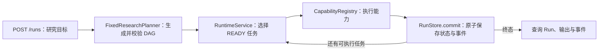

# M1 执行闭环实施记录

| 项目 | 内容 |
| --- | --- |
| 状态 | 已实现并验证 |
| 所属里程碑 | M1：最小可运行执行闭环 |
| 创建日期 | 2026-08-14 |
| 最后验证日期 | 2026-08-14 |
| 关联需求 | [PRD v0.2](../PRD.md) |
| 关联架构 | [Python 架构设计](../ARCHITECTURE.md) |
| 代码版本 | `agent/m1-runtime-agents-guide`，提交 `e7e8fdc`，GitHub Draft PR #1 |

## 1. 需求

基于 Sea-mult-agent 的科研执行业务语义，用 Python 建立第一个可运行的 ResearchFlow
Agent 垂直切片。调用方提交研究目标后，系统需要完成计划、按依赖执行任务、维护运行
状态、保存输出与事件，并提供 HTTP 接口查询和控制运行。

M1 的验收行为包括：

- 研究目标能够转换为一张合法任务图并执行到终态。
- 任务严格等待依赖成功，前序输出能够传给后续任务。
- 能力失败时按任务策略重试，超过次数后运行失败。
- 运行可以暂停、恢复和取消，迟到的旧执行结果不能覆盖新状态。
- 状态快照和对应事件原子提交，事件序号可用于稳定增量查询。
- API 能创建、查询和控制 Run，并把领域错误映射为稳定 HTTP 状态码。

## 2. 业务背景与问题

ResearchFlow Agent 面向需要多步骤完成的科研任务，例如资料收集、实验准备、执行分析和
报告生成。这类任务持续时间长、步骤之间存在依赖，并可能被暂停、取消、重试或从故障中
恢复。单次聊天式 Agent 调用无法可靠回答三个关键问题：当前执行到哪里、为什么得到这个
结果、失败后能否安全继续。

Sea-mult-agent 已经验证了计划图、状态机、事件、预算、租约和科研契约等业务方向，但其
实现和工程组织不是 Python 项目的直接模板。本项目需要保留这些核心语义，同时建立适合
Python、FastAPI、类型检查和后续异步基础设施接入的独立边界。M1 首先证明最小执行循环
成立，避免在真实模型、数据库和沙箱接入前堆积无法运行的抽象。

## 3. 范围与非目标

### 本步骤范围

- 固定三节点 DAG 的规划和校验。
- 确定性 Fake Capability 执行。
- Run 与 Task 的状态迁移、依赖调度、失败和重试。
- 暂停、恢复、取消和迟到结果隔离。
- 内存状态/事件存储及乐观版本检查。
- 创建、查询、事件读取和控制类 HTTP API。
- 正常、失败、竞争条件和 API 错误映射测试。

### 非目标

- 不调用真实大模型，也不声称具备自主科研质量。
- 不执行 Docker、Git 工作区或不可信代码。
- 不提供进程重启后的持久化与恢复。
- 不实现 SSE 实时事件、分布式 Worker、租约续期和全局预算结算。
- 不实现真实 Artifact Store 和 Scientific AutoResearch 的 Keep/Reject 实验循环。

## 4. 当前基线与参考

M1 采用“业务契约重构”而不是“逐文件翻译”：从 Sea-mult-agent 借鉴任务图、状态与事件、
可恢复控制和迟到结果隔离的语义；从 AGI-saber 参考 Python 包组织、FastAPI 入口和测试
习惯；领域模型、端口和运行服务均由 ResearchFlow Agent 独立实现。

| 能力 | 当前状态 | 证据或说明 |
| --- | --- | --- |
| 固定任务图规划 | 已实现 | [`FixedResearchPlanner`](../../src/researchflow/planning/fixed.py) |
| Run/Task 状态机 | 已实现 | [`domain/run.py`](../../src/researchflow/domain/run.py) 与状态测试 |
| 内存执行闭环 | 已实现 | [`RuntimeService`](../../src/researchflow/runtime/service.py) |
| 暂停/恢复/取消 | 已实现 | 运行服务和 [`test_service.py`](../../tests/runtime/test_service.py) |
| HTTP 创建、查询与控制 | 已实现 | [`api/app.py`](../../src/researchflow/api/app.py) 与 [`test_app.py`](../../tests/api/test_app.py) |
| 进程重启恢复 | 未实现 | 当前仅有内存 RunStore |
| 真实科研能力和沙箱 | 未实现 | 当前仅有 Fake Capability |
| AutoResearch 闭环 | 规划中 | 已保留可信边界，未在 M1 宣称可用 |

## 5. 方案与解决思路

端到端流程如下：

核心设计选择：

1. **先做同步确定性闭环。** M1 的目标是验证状态语义和模块边界，不把异步 Worker、
   数据库和真实模型的故障模式同时引入第一步。
2. **运行服务拥有生命周期。** API 仅负责协议转换，Capability 仅返回任务结果，所有状态
   迁移由 `RuntimeService` 统一编排，避免多处写状态形成不同事实来源。
3. **快照和事件一起提交。** RunStore 的提交接口同时接收预期版本、新快照和事件，保证
   查询到的状态与审计轨迹一致。
4. **执行身份与任务身份分离。** 同一任务在重试或恢复后仍有同一 `task_id`，但每次尝试
   都获得新的 `execution_id`，用于拒绝已经失效的旧结果。
5. **端口保持窄小。** Planner、Capability 和 RunStore 只暴露当前调用方需要的契约，后续
   SQLite、模型或 Docker 适配器可以替换实现，但不提前创建没有行为的通用框架。

## 6. 实现说明

| 模块或文件 | 职责 | M1 实现 |
| --- | --- | --- |
| [`domain/run.py`](../../src/researchflow/domain/run.py) | Run、Task、状态和领域规则 | 定义状态、任务依赖、执行尝试和快照 |
| [`runtime/service.py`](../../src/researchflow/runtime/service.py) | 运行生命周期编排 | 规划、就绪判断、执行、重试和控制命令 |
| [`runtime/store.py`](../../src/researchflow/runtime/store.py) | 存储端口与内存实现 | 原子提交、乐观版本和事件序号 |
| [`planning/fixed.py`](../../src/researchflow/planning/fixed.py) | 确定性规划器 | 生成 `collect_sources → prepare_experiment → write_report` |
| [`capabilities/contracts.py`](../../src/researchflow/capabilities/contracts.py) | 能力契约与注册表 | 定义窄接口并按能力名称解析执行实现 |
| [`adapters/capabilities/fake.py`](../../src/researchflow/adapters/capabilities/fake.py) | 测试执行适配器 | 生成确定性输出并支持故障注入 |
| [`api/app.py`](../../src/researchflow/api/app.py) | HTTP 协议层 | Run 路由和领域错误映射 |
| [`api/schemas.py`](../../src/researchflow/api/schemas.py) | 外部 Schema | 请求、快照、事件和命令响应模型 |
| [`bootstrap.py`](../../src/researchflow/bootstrap.py) | 组合根 | 组装规划器、存储、能力和运行服务 |

固定计划包含三个任务：

1. `collect_sources` 收集研究材料。
2. `prepare_experiment` 消费材料并准备实验上下文。
3. `write_report` 消费前两步输出并生成报告结果。

这张固定图不是最终产品能力，而是验证依赖传递、状态演进和 API 契约的确定性夹具。

## 7. 技术难点与解决方案

### 7.1 在重构中保留业务语义

- 现象：Sea-mult-agent 的目录、语言和运行方式与 Python 项目不同，逐文件翻译会把实现
  偶然性一并复制，并形成过大的 Agent 类。
- 根因：真正需要继承的是可观察行为和可信边界，不是原项目的物理结构。
- 候选方案：逐文件翻译；复用 Saber 的统一 Agent；围绕业务契约重新划分 Python 模块。
- 最终方案：以 PRD 和状态契约为基线，采用 `domain → runtime → adapters/api` 的依赖方向，
  只为已有调用方定义窄端口。
- 选择理由：能够独立测试核心行为，并允许后续替换规划器、存储和能力实现。

### 7.2 保证状态和事件一致

- 现象：如果先保存状态再写事件，中间失败会出现“状态已变化但没有证据”；反过来也会
  出现事件描述了尚未发生的状态。
- 根因：快照和事件属于同一次领域提交，却可能被当作两个写操作。
- 候选方案：调用方顺序写两次；事件失败后补偿；由存储端口提供原子提交。
- 最终方案：所有变化通过 `RunStore.commit(expected_version, run, events)` 提交，成功后
  同时推进版本和单 Run 事件序号；版本不匹配则拒绝写入。
- 选择理由：内存实现即可验证语义，后续数据库实现可直接映射到单事务。

### 7.3 隔离暂停和取消后的迟到结果

- 现象：能力执行期间收到暂停或取消命令时，旧调用仍可能返回；若按 `task_id` 接受结果，
  它会覆盖暂停、取消或恢复后的新状态。
- 根因：任务的稳定身份无法区分多次执行尝试。
- 候选方案：只检查 Task 状态；强制终止所有执行；为每次尝试增加唯一执行身份。
- 最终方案：每次尝试生成新的 `execution_id`。暂停或取消使当前 ID 失效；接收结果时同时
  校验任务状态和执行 ID，不匹配时记录 `task.result_ignored`，但不修改有效结果。
- 选择理由：不依赖底层调用能否立即取消，适用于未来线程、进程和远程 Worker。
- 残余风险：M1 为同步进程内执行，跨进程租约和 Worker 心跳需要后续补充。

### 7.4 重试后的错误语义

- 现象：第一次失败的信息需要审计，但后续重试成功后，当前快照不能继续表现为失败。
- 根因：历史证据和当前状态采用不同生命周期，混用一个错误字段会产生矛盾。
- 候选方案：成功后删除所有失败痕迹；永久保留当前错误；事件保存历史、快照只表示当前态。
- 最终方案：失败始终写入事件；仍可重试时重新调度，成功后清除快照中的当前任务错误，
  但不删除历史失败事件。
- 选择理由：查询当前状态不会误判，同时审计者仍能还原每次尝试。

### 7.5 API 与核心运行逻辑解耦

- 现象：若在 FastAPI 路由中直接修改状态，CLI、后台 Worker 和测试会重复业务规则。
- 根因：协议校验与领域编排没有明确边界。
- 最终方案：Pydantic 只存在于 HTTP 边界，路由调用 `RuntimeService` 命令，并统一把不存在、
  冲突和非法输入映射为 404、409、422。
- 选择理由：核心服务不依赖 Web 框架，可以用单元测试直接覆盖竞争与失败路径。

### 7.6 能力插件异常边界

- 现象：第三方能力可能抛出项目无法预先枚举的异常；完全不捕获会让 Run 留在运行中，
  静默吞掉则会伪造成功。
- 根因：插件是开放扩展边界，异常集合不受核心项目控制。
- 最终方案：只在能力调用边界有解释地捕获 `Exception`，转换为任务失败、重试或 Run 失败
  事件；核心业务内部仍捕获具体异常。
- 选择理由：保证所有插件失败都落入可审计状态，同时限制宽泛捕获的作用域。

## 8. 验证与证据

M1 交付时实际执行了以下检查：

| 检查 | 实际命令 | 结果 | 证据位置 |
| --- | --- | --- | --- |
| 行为测试 | `python -m pytest -q -W error::DeprecationWarning` | 16 项通过 | [`tests/`](../../tests) |
| 类型检查 | `python -m mypy src/researchflow` | 33 个源文件通过 | [`src/researchflow/`](../../src/researchflow) |
| 静态检查 | `python -m ruff check .` | 通过 | [`pyproject.toml`](../../pyproject.toml) |
| 格式检查 | `python -m ruff format --check .` | 40 个文件符合格式 | 代码工作区 |
| Python 3.11 编译 | `python -m compileall -q src tests` | 通过 | 源码与测试目录 |
| Python 3.12 编译 | Python 3.12 执行相同 `compileall` | 通过 | 源码与测试目录 |
| 包构建 | `python -m build --wheel` | Wheel 构建成功 | 构建日志；产物不提交仓库 |

测试覆盖重点包括依赖顺序、下游输入、失败重试、运行终态、暂停/恢复、取消、迟到结果
隔离、事件顺序、乐观锁以及 API 状态码映射。验证结果属于提交 `e7e8fdc` 所在 M1 代码；
若后续修改核心状态语义，必须重新执行这些检查并更新最后验证日期。

## 9. 当前限制、风险与非承诺

| 项目 | 当前边界 | 影响 |
| --- | --- | --- |
| 存储 | 仅进程内内存 | 重启后 Run 和事件丢失，不能用于生产恢复 |
| 规划 | 固定三节点任务图 | 不能根据任意研究目标动态生成可靠计划 |
| 能力 | Fake Capability | 输出只用于验证流程，不代表真实科研结论 |
| 执行 | `POST /runs` 内同步完成 | 长任务会占用请求，尚无后台 Worker |
| 事件 | 历史 JSON 增量读取 | 尚无 SSE 实时推送和断线重连 |
| 隔离 | 无 Docker/Git Sandbox | 不允许运行不可信代码或修改用户仓库 |
| 产物 | 输出保存在 Run 快照 | 尚无内容寻址、版本化和外部 Artifact Store |

因此，M1 只证明运行控制和审计语义的最小闭环，不承诺生产可用性、科研结论正确性、
分布式一致性或进程故障恢复能力。

## 10. 下一步

建议 M2 继续采用可运行垂直切片：

1. 实现 SQLite 异步 RunStore，并用同一组存储契约测试验证原子提交和乐观版本。
2. 将执行循环迁移到 AnyIO 后台任务，避免创建 Run 的 HTTP 请求被长任务占用。
3. 增加支持 `after_sequence` 回放的 SSE 事件流和断线重连测试。
4. 验证进程重启恢复、重复投递和迟到结果不会造成重复提交。

真实模型、Docker Sandbox 和 AutoResearch 应在持久化与恢复语义稳定后按独立里程碑接入。

## 11. 变更历史

| 日期 | 变更 | 作者 |
| --- | --- | --- |
| 2026-08-14 | 根据当前 M1 代码、测试和 Sea-mult-agent 文档组织方式创建实施记录 | ResearchFlow Agent 团队 |
